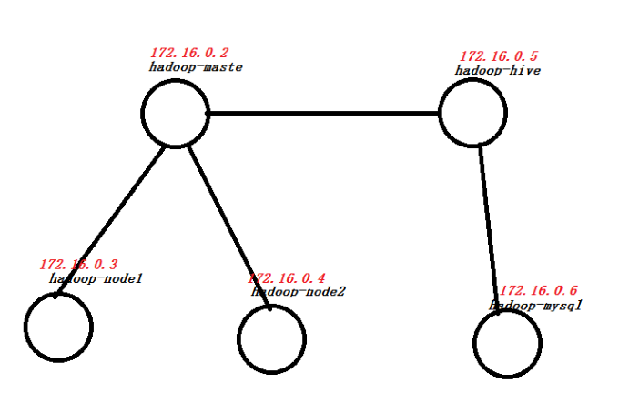

<!--
 *                        _oo0oo_
 *                       o8888888o
 *                       88" . "88
 *                       (| -_- |)
 *                       0\  =  /0
 *                     ___/`---'\___
 *                   .' \\|     |// '.
 *                  / \\|||  :  |||// \
 *                 / _||||| -:- |||||- \
 *                |   | \\\  - /// |   |
 *                | \_|  ''\---/''  |_/ |
 *                \  .-\__  '-'  ___/-. /
 *              ___'. .'  /--.--\  `. .'___
 *           ."" '<  `.___\_<|>_/___.' >' "".
 *          | | :  `- \`.;`\ _ /`;.`/ - ` : | |
 *          \  \ `_.   \_ __\ /__ _/   .-` /  /
 *      =====`-.____`.___ \_____/___.-`___.-'=====
 *                        `=---='
 * 
 * 
 *      ~~~~~~~~~~~~~~~~~~~~~~~~~~~~~~~~~~~~~~~~~~~
 * 
 *            佛祖保佑       永不宕机     永无BUG
 * 
 * @Author: lsl
 * @Date: 2020-08-30 15:23:04
 * @LastEditTime: 2020-08-30 15:36:32
 * @Description: build spark based on docker
 -->

# PySpark
Dockerfile and some resources to build Spark computer cluster
## Requirements
In order to reduce the size of the repo uploaded to GitHub, I removed softwares needed to build spark. 

The required softwares are listed below:
* apache-hive-2.3.2-bin.tar.gz
* hadoop-2.7.3.tar.gz
* jdk-8u101-linux-x64.tar.gz
* mysql-5.5.45-linux2.6-x86_64.tar.gz
* mysql-connector-java-5.1.37-bin.jar
* scala-2.11.8.tgz
* spark-2.3.0-bin-hadoop2.7.tgz

## Setup
1. cd spark/
2. run **build_net.sh** to build a network below

3. run **build.sh** to build the spark image

## Start
1. cd spark/config
2. run **start_containers.sh** for first starting containers or **restart_containers.sh** for you having already ran start_containers.sh before.
